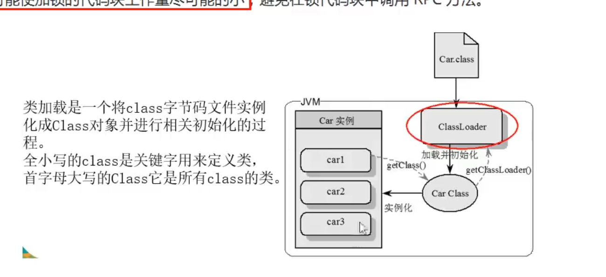

结论： 
● 对于普通同步方法，**锁的是当前实例对象**，通常指this，所有的同步方法用的都是同一把锁--->实例对象本身 
● 对于静态同步方法，**锁的时当前类的Class对象，也就是类本身，唯一模板Class** 
● 对于同步方法块，**锁的时synchronized括号内的对象** 
 
这个三个结论就对应了三个synchronized的应用方式 
3.2.2 synchronized有三种应用方式 
● 作用于实例方法，当前实例加锁，进入同步代码块前要获得当前实例的锁； 
● 作用于代码块，对括号里配置的对象加锁 
● 作用于静态方法，当前类加锁，进去同步代码前要获得当前类对象的锁 

class模板就是ClassLoader根据字节码文件加载类模板，然后根据类模板创建对象实例 
这个Car Class在方法区中有且只有一份。 
而对象锁在堆里面就多了去了,new出来一个就有一个 
